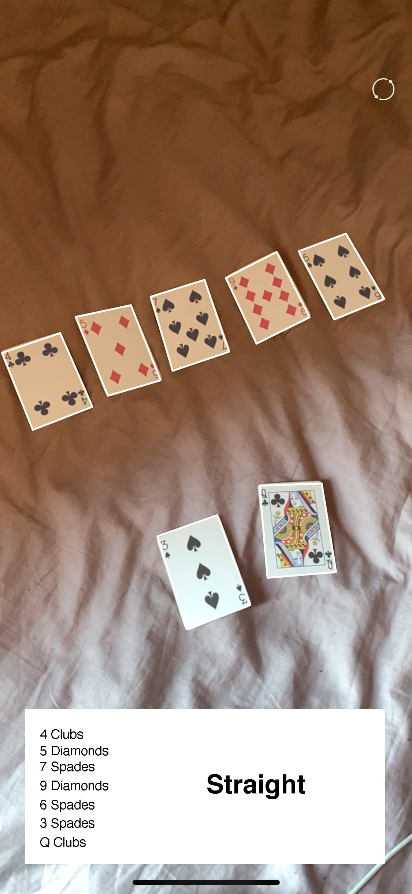
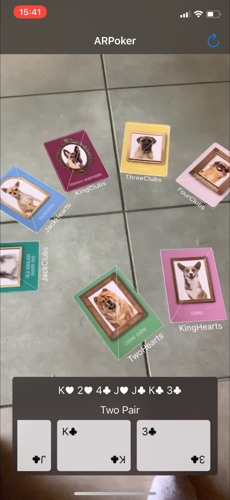

# Intro To Augmented Reality 302

<h3 align="center">Trystan Rivers 2020</h3>
 
 

   
  
  
  <h3 align="center">ARPoker</h3>

  

    learn poker the right way
     
    <a href="#about-the-project"><strong>Explore the docs »</strong></a>
     
     
    <a href="https://www.youtube.com/watch?v=h-PFgPhgUmQ">View Demo</a>
    ·
    <a href="https://www.youtube.com/watch?v=HjCTEK23mbA">Advert Spot</a>
  

## Table of Contents

* [About the Project](#about-the-project)
  * [Custom Cards](#custom-cards)
  * [Built With](#built-with)
* [Stages of Discovery](#stages-of-discovery)
  * [Prototype](#prototype)
  * [Completed Product](#completed-product)
* [App Features](#app-features)
* [User Guide](#user-guide)
  * [Installing and running the project](#installing-and-running-the-project)
  * [Using the app](#using-the-app)
* [Demo Video](#demo-video)
* [Extremely helpful projects](#extremely-helpful-projects)

## About The Project

Are you interested in learning the rules of poker? Would you like to engage in a worldwide phenomenon of Texas Hold 'Em but you're not sure where to start?

ARPoker is an augmented reality app which teaches you about the hands of poker in the best way possible - through augmented reality. 

The brief for this project was to create an augmented reality experience that responds to or enhances a real life object.

### Custom Cards

If you would like to use the app yourself, you need a custom deck of cards. Instructions on obtaining the deck or altering the code to include your deck is avaliable on command.

### Built With

* [Xcode](https://developer.apple.com/xcode/)
* [Swift](https://developer.apple.com/swift/)
* [ARKit](https://developer.apple.com/augmented-reality/)

### Stages of Discovery

1. ARKit Image Detection - I explored Apples built in method for detecting images in an AR Experience. This was done using [Apple's official ARKit Image Detection project](https://developer.apple.com/documentation/arkit/detecting_images_in_an_ar_experience).

    * Issue: Image detection worked extremely well, but the system failed to detect playing cards.
Reason: ARKit reference images need to be optimized for reliability and performance. Playing cards are not valid as they contain repeating patterns and are extremely similar in nature. ARKit will detect the two of clubs, the three of clubs and the four of clubs as the two of clubs.

2. ARKit & Machine Learning - I discovered a [machine learning ARKit solution](https://www.rightpoint.com/rplabs/dev/arkit-and-coreml), which used Apple's native CoreML. 

    * Issue: This solution did not work as expected, and the system still struggled to differentiate between similar looking cards. Even after it was trained on several cards, the machine learning output only provided 20% test accuracy.

3. Custom Playing Cards - An idea that was present from the start was custom playing cards being used. These would be perfect as each card would have a totally unique face, ensuring ARKit recognizes each card. I stumbled into custom cards with images of dogs as the face. These were perfect and are being used to power the image recognition capabilities of the app. 

### Prototype
	

   
  

### Completed Product

   
  

### App Features:
* Custom Designed Logo
* Augmented Reality Image Detection
* Augmented Reality Node Addition
* Machine Learning Integration (Removed)
* BitCardPoker Library for Poker hand detection
* Custom Poker class which interfaces the view with the data with the library
* Object Oriented Design Philosophy
* User View interaction (Swiping card interface)
* User View animations
* Multithread configuration
* Reset Functionality

### User Guide
#### Installing and running the project

1. Clone this repo to your local Macintosh machine.
1. Open ARPoker.xcodeproj in XCode.
1. Ensure the team is selected 
1. Connect your iPhone via a usb cable.
1. Select your iPhone as the target device.
1. The project will be running on your iPhone.

### User Guide
#### Using the app

1. Move the cards to be scanned into view face up
1. Ensure a card is scanned by the addition of a card to the card view located at the bottom of the screen
1. Scan 5 or 7 cards to evaluate a poker hand
1. A poker hand evaluation is written in the bottom view

### Demo Video
[Advert Spot](https://www.youtube.com/watch?v=HjCTEK23mbA)

[Short Demo](https://www.youtube.com/watch?v=h-PFgPhgUmQ)

### Extremely helpful projects: 
I couldn't have completed my own project without the core principles and frameworks these apps taught.

[ARKit-CoreML](https://github.com/Rightpoint/ARKit-CoreML) - Provided a framework for Machine Learning in AR, as well as a framework for this app

[BitCardPoker](https://github.com/floatmingo/BitCardPoker) - Provides a library for evaluating poker hands, extremely useful and works well
